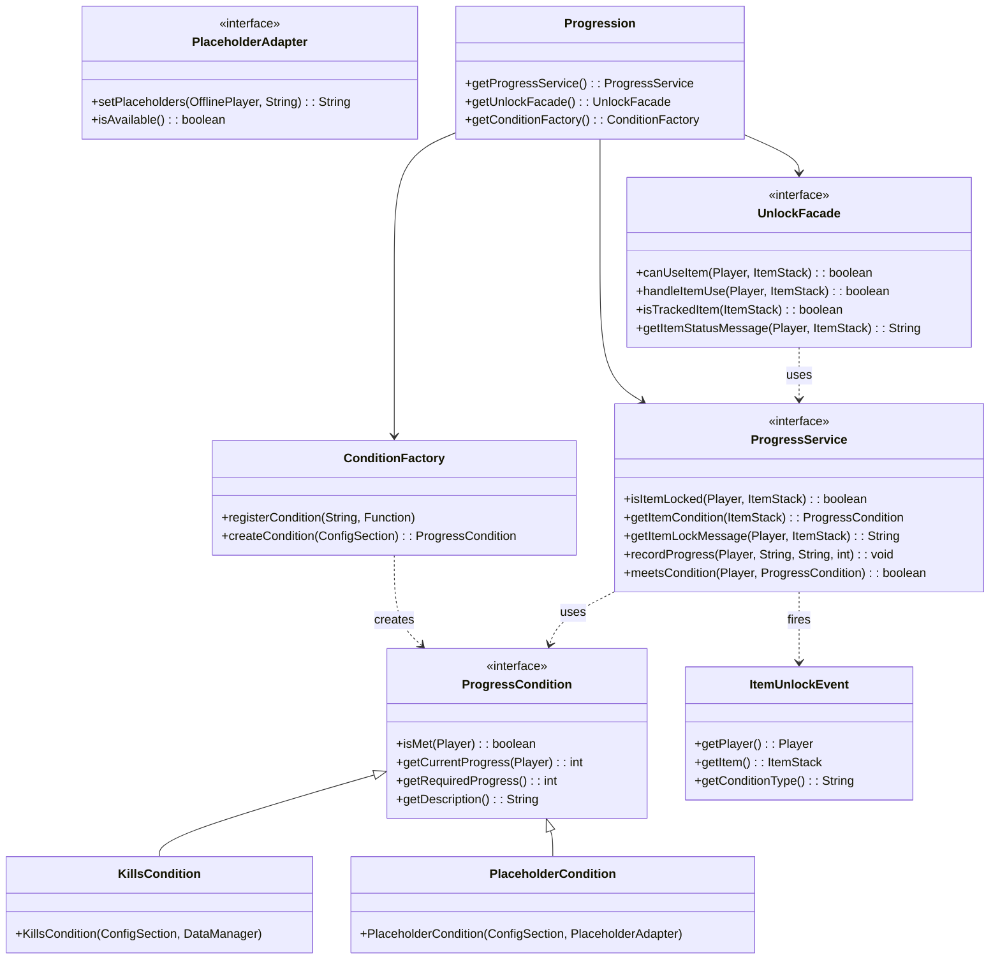

```mermaid
classDiagram
    %% Core Interfaces
    class ProgressCondition {
        <<interface>>
        +isMet(Player): boolean
        +getCurrentProgress(Player): int
        +getRequiredProgress(): int
        +getDescription(): String
    }
    
    class ProgressService {
        <<interface>>
        +isItemLocked(Player, ItemStack): boolean
        +getItemCondition(ItemStack): ProgressCondition
        +getItemLockMessage(Player, ItemStack): String
        +recordProgress(Player, String, String, int): void
        +meetsCondition(Player, ProgressCondition): boolean
    }
    
    class UnlockFacade {
        <<interface>>
        +canUseItem(Player, ItemStack): boolean
        +handleItemUse(Player, ItemStack): boolean
        +isTrackedItem(ItemStack): boolean
        +getItemStatusMessage(Player, ItemStack): String
    }
    
    class PlaceholderAdapter {
        <<interface>>
        +setPlaceholders(OfflinePlayer, String): String
        +isAvailable(): boolean
    }
    
    class ConditionFactory {
        +registerCondition(String, Function)
        +createCondition(ConfigSection): ProgressCondition
    }
    
    %% Core Implementation
    class Progression {
        +getProgressService(): ProgressService
        +getUnlockFacade(): UnlockFacade
        +getConditionFactory(): ConditionFactory
    }
    
    %% Condition Implementations
    class KillsCondition {
        +KillsCondition(ConfigSection, DataManager)
    }
    
    class PlaceholderCondition {
        +PlaceholderCondition(ConfigSection, PlaceholderAdapter)
    }
    
    %% Events
    class ItemUnlockEvent {
        +getPlayer(): Player
        +getItem(): ItemStack
        +getConditionType(): String
    }
    
    %% Relationships
    ProgressCondition <|-- KillsCondition
    ProgressCondition <|-- PlaceholderCondition
    
    Progression --> ProgressService
    Progression --> UnlockFacade
    Progression --> ConditionFactory
    
    ConditionFactory ..> ProgressCondition : creates
    
    ProgressService ..> ProgressCondition : uses
    ProgressService ..> ItemUnlockEvent : fires
    
    UnlockFacade ..> ProgressService : uses
``` 